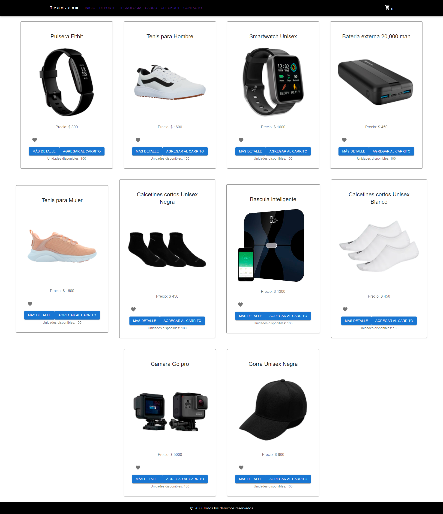
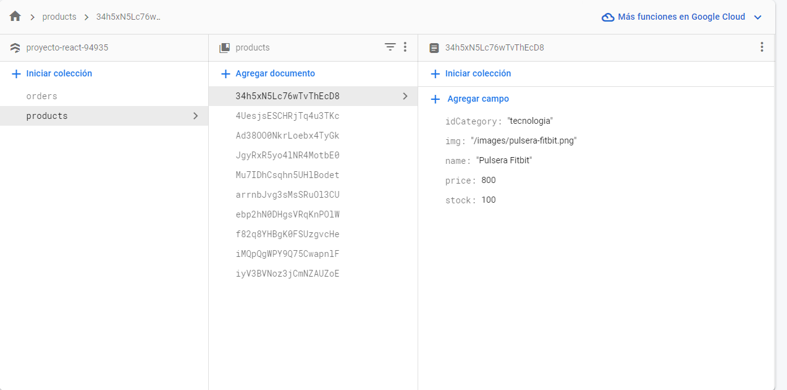

## Proyecto Final- Cursada 44970 React JS

#### CoderHouse React JS

E-Commerce

De acuerdo a lo visto en el curso, se genera una apicacion de Comercio Electronico.

## Estatus del proyecto

#### En proceso

Por el momento se puede agregar productos a un carrito sin permnencia de datos esto quiere decir que si refrescas la ventana o cierras la ventana los productos son borrados. En aspecto de diseño hace faltan estilo mas visibles en los componentes Carrito, Checkout y  el calltoaction de favoritos. 

## Captura de Pantalla

## Instrucciones de instalación

#### Primeros pasos  

Clona este repositorio. Necesitas tener instalado `node` y `npm` en tu maquina.  

Secuencia de comandos

`npm install`  

Haz un test inicial:  

`npm test`  

Inicia el Sever:

`npm start`  

Ve a al página local:

`localhost:3000`  

## Firebase

  - En en componente App.js tendrás que poner tus datos de conexión a tu base de datos en FireStore
  - La colección de productos contiene como strings `idCategory` ; `img` ; `name` y como number `price` y `stock`
  - Tambien necesitaras crear una coleccion con el nombre `orders` en donde se almacenarán las ordenes de compra.

  